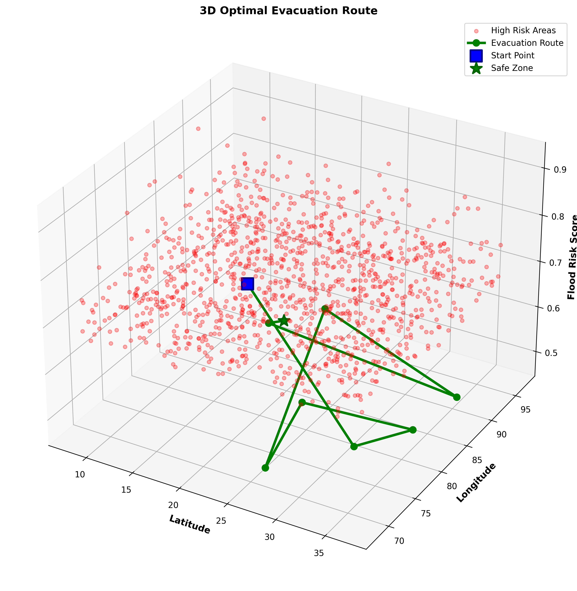

# 3D Optimal Evacuation Route - Statistical and Layman Explanation



## 1. What This Picture Shows

This figure is a 3D visualization of an optimized flood evacuation route generated from the `Advanced_PSO_Evacuation_Model_3D.py` code using the India flood-risk CSV dataset.

The chart combines three ideas in one view:

| Visual Element | Meaning |
|---|---|
| X-axis: Latitude | North-south geographic position |
| Y-axis: Longitude | East-west geographic position |
| Z-axis: Flood Risk Score | Estimated flood danger from 0 to 1 |
| Red transparent points | High-risk locations where `Flood_Risk_Score > 0.66` |
| Green line with circles | Optimized evacuation route selected by PSO |
| Blue square | Starting location of the evacuation route |
| Green star | Final safe-zone destination |

In simple terms, the picture shows a planned route from a starting area toward a safer destination while trying to avoid the densest and highest flood-risk areas.

## 2. Data Used in the Figure

The source dataset contains 10,000 geographic locations across India-like latitude and longitude bounds.

| Dataset Metric | Value |
|---|---:|
| Total locations | 10,000 |
| Latitude range | 8.0003 to 36.9918 |
| Longitude range | 68.0046 to 96.9978 |
| Recorded flooded locations | 5,057 |
| Recorded non-flooded locations | 4,943 |
| Flooded share | 50.57% |

The model calculates a new field called `Flood_Risk_Score`. This is not directly stored in the original CSV; it is computed inside the Python code.

## 3. How the Flood Risk Score Is Calculated

The code creates a composite flood-risk score from environmental and infrastructure variables.

Risk-increasing factors:

| Factor | Weight |
|---|---:|
| Rainfall | 30% |
| River discharge | 25% |
| Water level | 25% |
| Population density | 20% |

Safety-reducing adjustment:

| Safety Factor | Effect |
|---|---|
| Elevation | Higher elevation reduces flood risk |
| Infrastructure | Better infrastructure reduces flood risk |

The final risk score is calculated as:

```text
Flood Risk Score =
70% weighted water/population risk
+ 30% inverted safety risk from elevation and infrastructure
```

So, a place becomes more dangerous when it has more rainfall, stronger river discharge, higher water level, and denser population. It becomes safer when it has higher elevation and better infrastructure.

## 4. Statistical Analysis of the Dataset

### 4.1 Flood Risk Category Distribution

The model classifies each location into low, medium, or high risk.

| Risk Category | Score Range | Count | Percentage | Interpretation |
|---|---:|---:|---:|---|
| Low | 0.00 to 0.33 | 1,084 | 10.84% | Monitor only |
| Medium | 0.33 to 0.66 | 7,713 | 77.13% | Prepare and stay alert |
| High | 0.66 to 1.00 | 1,203 | 12.03% | Priority evacuation zone |

Most locations fall in the medium-risk group. The red points in the image represent the 1,203 high-risk locations, which are the most important areas for emergency planning.

### 4.2 Risk Score Summary

| Statistic | Flood Risk Score |
|---|---:|
| Minimum | 0.0560 |
| 25th percentile | 0.4055 |
| Median | 0.5014 |
| Mean | 0.5010 |
| 75th percentile | 0.5950 |
| 90th percentile | 0.6740 |
| 95th percentile | 0.7216 |
| Maximum | 0.9217 |
| Standard deviation | 0.1339 |

The average and median risk scores are both close to 0.50, meaning the dataset is centered around moderate flood risk. The high-risk cutoff is 0.66, so only the upper tail of the distribution appears as red points in this figure.

### 4.3 Main Variable Statistics

| Variable | Mean | Median | Minimum | Maximum |
|---|---:|---:|---:|---:|
| Rainfall (mm) | 150.02 | 150.62 | 0.01 | 299.97 |
| River discharge (m3/s) | 2,515.72 | 2,530.45 | 0.04 | 4,999.70 |
| Water level (m) | 5.02 | 5.04 | 0.00 | 10.00 |
| Elevation (m) | 4,417.14 | 4,417.20 | 1.15 | 8,846.89 |
| Population density | 5,021.47 | 5,074.39 | 2.29 | 9,999.17 |
| Infrastructure | 0.50 | 1.00 | 0 | 1 |

These values show that the dataset has a broad spread: some locations are very low-lying, some are very high elevation, some have almost no rainfall, and some have rainfall near 300 mm.

### 4.4 Relationship Between Variables and Risk Score

Correlation with `Flood_Risk_Score`:

| Variable | Correlation | Meaning |
|---|---:|---|
| Rainfall | +0.4516 | More rainfall generally increases risk |
| Water level | +0.3822 | Higher water level increases risk |
| River discharge | +0.3690 | Stronger river flow increases risk |
| Population density | +0.3131 | Dense areas receive higher planning risk |
| Elevation | -0.3314 | Higher elevation lowers risk |
| Infrastructure | -0.5602 | Infrastructure strongly lowers risk |
| Flood occurred label | -0.0017 | Almost no direct linear relationship in this synthetic-style dataset |

The strongest protective factor in the computed score is infrastructure, followed by elevation. The strongest danger factor is rainfall.

## 5. Route Optimization Analysis

The green evacuation path is created by Particle Swarm Optimization (PSO). PSO tests many possible routes and keeps improving them over iterations.

In the code:

| PSO Setting | Value |
|---|---:|
| Swarm size | 40 particles |
| Route length | 9 nodes |
| Iterations | 100 |
| Safe zones selected | 5 |
| Population assumed for evacuation | 10,000 people |

The optimizer scores each route using three goals:

| Goal | Direction |
|---|---|
| Travel time | Minimize |
| Flood-risk exposure | Minimize |
| Elevation gain | Maximize |

This is why the green route is not simply the straightest line. The algorithm is trying to balance distance, danger, and safer elevation.

The preserved project output for the generated route reports:

| Route Metric | Value |
|---|---:|
| Route length | 9 nodes |
| Total distance | 1.00 grid units |
| Total risk exposure | 0.5054 |
| Route fitness score | 176.0016 |
| Estimated travel time | 10 minutes |
| Evacuation capacity assumption | 100 people/hour |
| Total evacuation duration for 10,000 people | 100 hours |

Important note: the Python code does not set a fixed NumPy random seed before PSO route generation. Because of this, a new run can produce a slightly different green route even with the same CSV file.

## 6. Layman Explanation

Imagine the red dots as dangerous flood-prone places on a map. The higher a red dot appears in the 3D plot, the higher its flood danger score.

The blue square is where people start. The green star is the safer place they should reach. The green line is the suggested evacuation path.

The computer does not choose the route only by shortest distance. Instead, it asks:

- Is this route passing through dangerous flood areas?
- Does the route move toward safer or higher ground?
- Is the path reasonably short?
- Does it avoid the worst red clusters?

So, if the route bends or zig-zags, that is intentional. It is trying to avoid risky zones while still reaching a safe zone.

The easiest way to read the picture is:

```text
Blue square = start here
Red dots = avoid these risky areas
Green line = recommended path
Green star = safe destination
Higher Z value = higher flood danger
```

## 7. Practical Meaning for Flood Evacuation

The figure is useful for emergency planning because it highlights both danger zones and an escape path in the same view.

Key planning insights:

- High-risk areas are a minority of the dataset, about 12.03%, but they should receive priority attention.
- Most areas are medium risk, so evacuation planning should not focus only on extreme zones.
- The selected route tries to reduce exposure to high-risk red clusters.
- Safe zones are chosen using low flood risk and high elevation.
- Infrastructure and elevation are major safety factors in the model.

For decision-makers, this means the model can help identify where to evacuate first, where safe zones should be located, and which route should be preferred during flood emergencies.

## 8. Limitations

This visualization is a model output, not a real-time operational evacuation command.

Main limitations:

- The route is based on a 10x10 grid, so it is a simplified spatial network rather than actual roads.
- The PSO route may change between runs because no random seed is fixed.
- The model uses calculated risk scores, not live rainfall, live river sensors, or real traffic conditions.
- The `Flood Occurred` field has almost no linear correlation with the computed risk score in this dataset, suggesting the dataset may be synthetic or not strongly aligned with the score formula.
- Real evacuation planning would need road networks, bridge status, shelter capacity, traffic congestion, communication access, and local administrative constraints.

## 9. Final Interpretation

The image shows a computer-optimized evacuation route across a flood-risk landscape. Red points mark high-risk locations, the blue square marks the starting point, and the green star marks a safer destination. Statistically, the dataset is mostly medium risk, with 12.03% of locations classified as high risk. The route is designed to reduce exposure to those high-risk zones while moving toward a safer, higher-elevation area.

In simple words: the model is trying to guide people from danger toward safety while avoiding the most flood-prone places.
